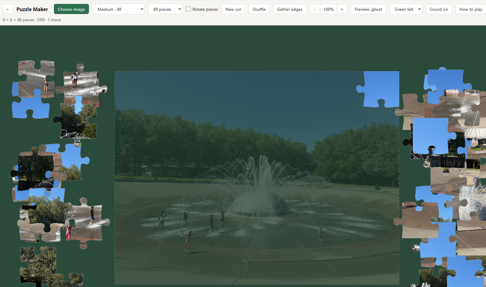

# Puzzle Maker

Turn any image into a jigsaw puzzle and play it in your browser.

**Play it:** https://billjohk.github.io/puzzle_maker/



Your image never leaves your browser. There's no server: the image is cut up on your device, and saved progress stays in your browser's storage.

## Features

- Classic jigsaw-shaped pieces cut from any photo, from 4 to 500 pieces, with difficulty presets
- Pieces snap together into groups and lock onto the board when placed correctly
- Optional piece rotation for an extra challenge
- Progress saves automatically and comes back on your next visit
- Preview ghost or thumbnail, "Gather edges" to sort border pieces, and shuffle
- Zoom and pan, with pinch and touch support on phones and tablets
- Timer, move counter, sounds, a choice of table colors, and a sample puzzle to try

The **How to play** button in the app lists all the controls.

## Development

Requires Node.js and [pnpm](https://pnpm.io/).

```sh
pnpm install
pnpm dev      # local dev server
pnpm test     # unit tests (Vitest)
pnpm build    # type-check and build to dist/
```

Built with TypeScript, Vite, and the HTML canvas. There are no runtime dependencies.

## Deployment

Every push to `main` runs the tests and publishes the site to GitHub Pages (see `.github/workflows/deploy.yml`).
